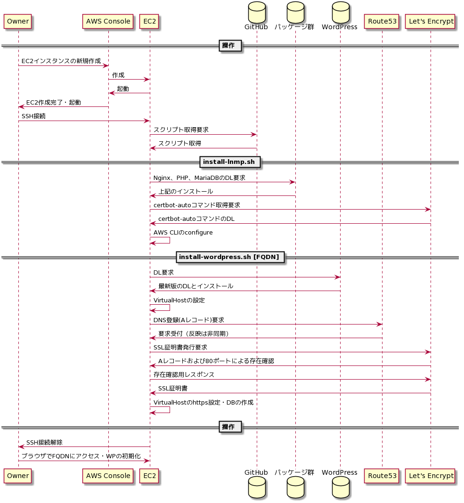

# ec2-wordpress-builer
AWSのEC2上にWordPress環境を作成するためのスクリプト

## 使い方

### 0. 前提条件

- AWS CLIを利用するためのIAMユーザを用意してください。
    - EC2とRoute53に対しての操作権限を設定してください。
    - アクセスキーとシークレットキーを控えてください。
- Route53にて、作成するサイトのドメインを管理するホストゾーンを用意してください。
- SSL証明書を取得するための連絡先メールアドレスをご用意ください。

### 1. EC2の起動

1. AWS ConsoleでEC2を新規作成します。
1. AMIは `Amazon Linux 2` を選択してください。
1. 他の項目は任意に設定して、起動してください。
1. ElasticIPを割り当ててグローバルIPアドレスを固定としてください。
1. sshで起動したEC2にログインします。
```
ssh -i xxx.pem ec2-user@XXX.XXX.XXX.XXX
```

### 2. Nginx1.x / PHP7.2 / MariaDB10のインストール

1. 以下のコマンドを実行してください。
    - install-lnmp.shの仕様は以下の通りです。
    - 第１引数：AWS CLIのアクセスキー
    - 第２引数：AWS CLIのシークレットキー
```
cd ~
wget https://raw.githubusercontent.com/tri-comma/ec2-wordpress-builer/master/install-lnmp.sh
chmod 744 install-lnmp.sh
./install-lnmp.sh XXXXXXXXXXXXXXXXXXXX xxxxxxxxxxxxxxxxxxxxxxxxxxxxxxxxxxxxxxxx
```
2. ブラウザでページが参照できるか確認してください。
```
http://www.hogehoge.com
```

### 3. WordPressのインストール

1. 以下のコマンドを実行してください。
    - install-wordpress.shの仕様は以下の通りです。
    - 第１引数：作成するサイトのFQDN
    - 第２引数：Route 53で管理するホストゾーンのドメイン名
    - 第３引数：SSL証明書取得用メールアドレス
```
cd ~
wget https://raw.githubusercontent.com/tri-comma/ec2-wordpress-builer/master/install-wordpress.sh
chmod 744 install-wordpress.sh
./install-wordpress.sh www.hogehoge.com hogehoge.com user@hogehoge.com
```
2. ブラウザでWordPressのインストールを開始してください。
```
https://www.hogehoge.com
```
- データベース名：FQDNのドットおよびハイフンをアンダースコアに変換した名称
- ユーザ名：root
- パスワード：なし
- ホスト名：localhost
- テーブル接頭子：wp_（任意に設定可能）

## シーケンス図



### PlantUML

```
== 操作 ==
participant Owner
participant "AWS Console" as AWS
participant EC2
database GitHub
database "パッケージ群" as PKG
database "WordPress" as WP
participant Route53 as R53
participant "Let's Encrypt" as LE
Owner -> AWS:EC2インスタンスの新規作成
AWS->EC2:作成
EC2->AWS:起動
AWS -> Owner:EC2作成完了・起動
Owner -> EC2:SSH接続
EC2 -> GitHub:スクリプト取得要求
GitHub -> EC2:スクリプト取得
== install-lnmp.sh ==
EC2 -> PKG:Nginx、PHP、MariaDBのDL要求
PKG -> EC2:上記のインストール
EC2 -> LE:certbot-autoコマンド取得要求
LE -> EC2:certbot-autoコマンドのDL
EC2 -> EC2:AWS CLIのconfigure
== install-wordpress.sh [FQDN] ==
EC2 -> WP:DL要求
WP -> EC2:最新版のDLとインストール
EC2 -> EC2:VirtualHostの設定
EC2 -> R53:DNS登録(Aレコード)要求
R53 -> EC2:要求受付（反映は非同期）
EC2 -> LE:SSL証明書発行要求
LE -> EC2:Aレコードおよび80ポートによる存在確認
EC2 -> LE:存在確認用レスポンス
LE -> EC2:SSL証明書
EC2 -> EC2:VirtualHostのhttps設定・DBの作成
== 操作 ==
EC2->Owner:SSH接続解除
Owner -> EC2:ブラウザでFQDNにアクセス・WPの初期化
```


